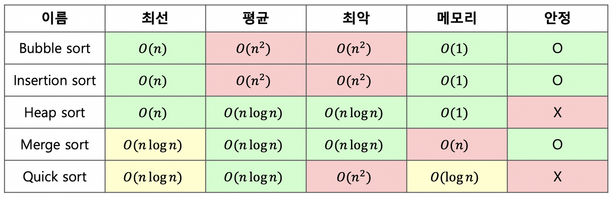

# Timsort

1. 특징
- 실제 데이터는 대부분 이미 정렬되어 있을 것이다-를 가정에 기반한 정렬 알고리즘
- 삽입 정렬과 병합 정렬을 적절히 조합한 알고리즘

2. 아이디어
- 전체 배열을 작은 덩어리로 잘라 각각의 덩어리를 삽입 정렬을 진행한 후, 병합 정렬을 진행하자!

3. 참고 자료
- 2001년 만들어진 알고리즘으로 파이썬을 위해 C 언어로 구현됨.
- [티스토리 - 파이썬 정렬 알고리즘](https://questionet.tistory.com/61)
